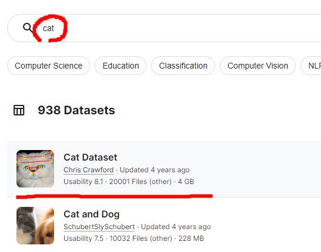
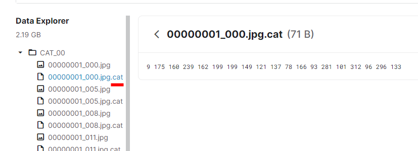
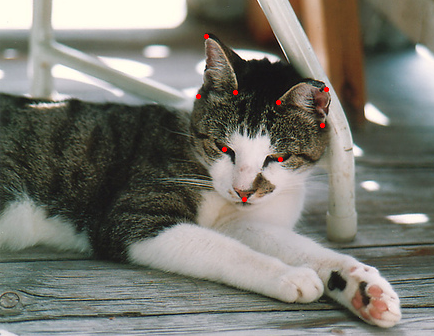

# 고양이 얼굴 인식

## 고양이 이미지 데이타셑 다운로드
[https://www.kaggle.com/datasets](https://www.kaggle.com/datasets)



### .cat 화일 의미
```
9 175 160 239 162 199 199 149 121 137 78 166 93 281 101 312 96 296 133 
```
- 맨 앞 숫자 : 9 - 9개의 점이 있다
- 그다음부터는 9개 점의 좌표 (175, 160), (239, 162)....

에러
'DataFrame' object has no attribute 'as_matrix'
df.as_matrix() is deprecated, see this answer. TL;DR try using df.to_numpy

## 좌표확인
.cat 과 이미지위 위치를 확인한다.
```
import random
import dlib, cv2, os
import pandas as pd
import numpy as np

dirname = 'CAT_00'
base_path = 'assets/data_cat_images/archive/%s' % dirname
file_list = sorted(os.listdir(base_path))
random.shuffle(file_list)

for f in file_list:
    if '.cat' not in f:
        continue

    # read landmarks
    pd_frame = pd.read_csv(os.path.join(base_path, f), sep=' ', header=None)  # 공백으로 분리
    landmarks = (pd_frame.to_numpy()[0][1:-1]).reshape((-1, 2)).astype(np.int)  # 1차원을 9 x 2 의 형태로 변경 
    # [331. 327. 444. 301. 410. 408. 236. 311. 198. 161. 303. 218. 418. 193.487.  92. 510. 251.]
    # ->[[331. 327.]... ]
    # 
    # load image
    img_filename, ext = os.path.splitext(f)

    img = cv2.imread(os.path.join(base_path, img_filename))

    # visualize
    for l in landmarks:
        cv2.circle(img, center=tuple(l), radius=1, color=(0, 0, 255), thickness=2)

    cv2.imshow('img', img)
    if cv2.waitKey(0) == ord('q'):
        break

```
