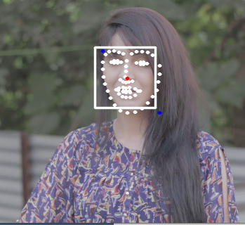

# 사람 얼굴 인식
원본 : https://opentutorials.org/module/3811/22895

## shape_predictor_68_face_landmarks.dat 모델 다운로드
[다운로드](https://github.com/davisking/dlib-models/blob/master/shape_predictor_68_face_landmarks.dat.bz2)

## mp4 다운로드
[다운로드](https://www.pexels.com/)
## 모듈 임포트
```
import sys
import numpy as np
import cv2
import dlib
```

## initialize face detector and shape predictor
```
detector = dlib.get_frontal_face_detector()
predictor = dlib.shape_predictor('assets/data/shape_predictor_68_face_landmarks.dat')
```

##  load video & Mask image
```
# load video
cap = cv2.VideoCapture('assets/mp4/girl.mp4')
# load overlay image
overlay = cv2.imread('assets/images/ryan_transparent.png', cv2.IMREAD_UNCHANGED)  # IMREAD_UNCHANGED: 알파값을 표혀하기 위해
```

## 비데오 출력
```
while True:
    # read frame buffer from video
    ret, img = cap.read()

    if not ret:
        break

    # resize frame (비데오의 크기를 줄인다.)
    scaler = 0.3
    img = cv2.resize(img, (int(img.shape[1] * scaler), int(img.shape[0] * scaler)))
  
    # visualize
    cv2.imshow('img', img)
    if cv2.waitKey(1) == ord('q'):
        sys.exit(1)
```
기본적인 구성은 완료되었습니다. \
## detector 를 이용한 얼굴 영역 가져오기
이제 얼굴영역주위로 사각형 박스를 출력하겠습니다.
```
while True:
    ..........
    # detect faces
    faces = detector(img)
    face = faces[0]

    img = cv2.rectangle( # 현재 이미지에 사각형을 그리는 구문
        img,
        pt1=(face.left(), face.top()),
        pt2=(face.right(), face.bottom()),
        color=(255, 255, 255),
        thickness=2,
        lineType=cv2.LINE_AA

    )
    ..........
```
face 위의 결과로 rectangles[[(235, 76) (325, 166)]] 를 얻는다.


## predictor 를 이용한 얼굴 특징점 추출
```
while True:
    ..........
    # detect faces
    faces = detector(img)
    face = faces[0]

    dlib_shape = predictor(img, face)  # 이미지와 얼굴 영역을 입력함
    shape_2d = np.array([[p.x, p.y] for p in dlib_shape.parts()])
    # print(shape_2d)  # [[246 101].. 68개]
    
    for s in shape_2d:  # 68개의 위치에 점을 찍는다
    cv2.circle(img, center=tuple(s), radius=1, color=(255, 255, 255), thickness=2, lineType=cv2.LINE_AA)

    ..........
```


## 얼굴 특장점으로 부터 좌상, 우하 좌표 구하기
```
while True:
    ..........
    for s in shape_2d:  # 68개의 위치에 점을 찍는다
    cv2.circle(img, center=tuple(s), radius=1, color=(255, 255, 255), thickness=2, lineType=cv2.LINE_AA)

    # 좌상단 우하단 구하고 센터 찾기
    top_left = np.min(shape_2d, axis=0)
    bottom_right = np.max(shape_2d, axis=0)

    # draw min, max coords
    cv2.circle(img, center=tuple(top_left), radius=1, color=(255, 0, 0), thickness=2, lineType=cv2.LINE_AA)
    cv2.circle(img, center=tuple(bottom_right), radius=1, color=(255, 0, 0), thickness=2, lineType=cv2.LINE_AA)
    ..........
```
아래 그림과 같이 좌상, 우하에 파란색 점이 표시된다.


## 중간점 구하기
```
while True:
    ..........
    # compute face center
    center_x, center_y = np.mean(shape_2d, axis=0).astype(np.int)
    cv2.circle(img, center=tuple((center_x, center_y)), radius=1, color=(0, 0, 255), thickness=2, lineType=cv2.LINE_AA)
    ..........
```
아래 그림과 같이 빨간 점이 표시됩니다.


## 현재 위치에 이미지 띄우기
중앙점을 구했으므로 이 위치에 이미지를 띄우도록 하겠습니다.
먼저 사용할 함수 입니다.
```
def overlay_transparent(movie, image, x, y, overlay_size=None):
    """
    :param movie: 동영상 
    :param image: 오버레이할 이미지
    :param x: face center x
    :param y: face center y
    :param overlay_size: 오버레이할 얼굴의 사이즈
    :return:
    """
    m_clip = movie.copy()
    # convert 3 channels to 4 channels (BGR to RGB)
    if m_clip.shape[2] == 3:
        bg_img = cv2.cvtColor(m_clip, cv2.COLOR_BGR2BGRA)

    if overlay_size is not None:
        image = cv2.resize(image.copy(), overlay_size)

    b, g, r, a = cv2.split(image)

    mask = cv2.medianBlur(a, 5)

    h, w, _ = image.shape
    roi = bg_img[int(y-h/2):int(y+h/2), int(x-w/2):int(x+w/2)]

    img1_bg = cv2.bitwise_and(roi.copy(), roi.copy(), mask=cv2.bitwise_not(mask))
    img2_fg = cv2.bitwise_and(image, image, mask=mask)

    bg_img[int(y-h/2):int(y+h/2), int(x-w/2):int(x+w/2)] = cv2.add(img1_bg, img2_fg)

    # convert 4 channels to 4 channels
    bg_img = cv2.cvtColor(bg_img, cv2.COLOR_BGRA2BGR)

    return bg_img
```
이것을 호출만 하면 끝납니다.
```
while True:
    ..........
    # draw overlay on face
    face_size = max(bottom_right - top_left)  # 얼굴 사이즈 구하기
    result = overlay_transparent(ori, overlay, center_x, center_y,
                                 overlay_size=(face_size, face_size))
    ..........
    # visualize
    cv2.imshow('result', result)
    ..........
```

