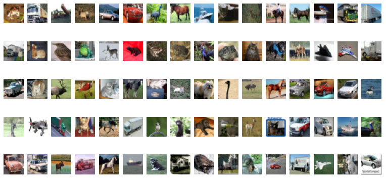
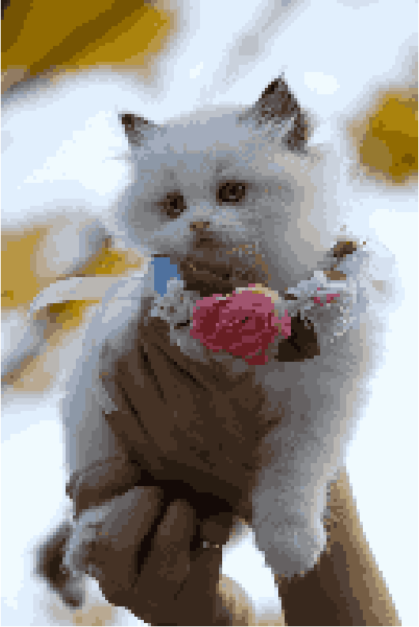

# Image Mosaic - Color

## import
```
import cv2, os
import numpy as np
import matplotlib.pyplot as plt
from collections import defaultdict
import tensorflow as tf

from sklearn.cluster import KMeans
from sklearn.metrics import pairwise_distances_argmin_min  # 가까운 색상을 비교
from sklearn.utils import shuffle

import ssl
ssl._create_default_https_context = ssl._create_unverified_context
```
## 이미지 불러오기
```
img_path = 'assets/images/samples/01.jpg'
img = cv2.imread(img_path)
img = cv2.resize(img, dsize=None, fx=0.2, fy=0.2)  # 크기는 20%로 줄임
img = cv2.cvtColor(img, cv2.COLOR_BGR2RGB)  # color를 BGR 에서 RGB로 변경
```
원본이미지 \

변경후 이미지 \


## Load and Preview Patch Images (CiFAR-10)
로드하는 두가지 방법은 설명드립니다. \
### 미리다운받아서 처리하는 방법
```
def unpickle(file):
    import pickle
    with open(file, 'rb') as fo:
        dict = pickle.load(fo, encoding='bytes')
    data = dict[b'data'].reshape((-1, 3, 32, 32)).transpose(0, 2, 3, 1).astype(np.float64) / 255.
    return data
    
x_train_1 = unpickle('assets/dataset/data_batch_1')
x_train_2 = unpickle('assets/dataset/data_batch_2')
x_train_3 = unpickle('assets/dataset/data_batch_3')
x_train_4 = unpickle('assets/dataset/data_batch_4')
x_train_5 = unpickle('assets/dataset/data_batch_5')

sample_imgs = np.concatenate([x_train_1, x_train_2, x_train_3, x_train_4, x_train_5], axis=0)

```
### 실시간으로 다운받아서 처리하는 방법
```
cifar10 = tf.keras.datasets.cifar10
(train_images, train_labels), (test_images, test_labels) = cifar10.load_data()
sample_imgs = train_images.astype(np.float64) / 255.
```
Error \
실시간 처리일경우 아래와 같은 에러가 발생한다.
```
Exception: URL fetch failure on https://www.cs.toronto.edu/~kriz/cifar-10-python.tar.gz: None -- [SSL: CERTIFICATE_VERIFY_FAILED] certificate verify failed: certificate has expired (_ssl.c:1131)
```
Solution
```
import ssl
ssl._create_default_https_context = ssl._create_unverified_context
```
## Mnist 샘플 이미지 출력
```
plt.figure(figsize=(20, 10))
for i in range(80):
    img_patch = sample_imgs[i]

    plt.subplot(5, 16, i + 1)
    plt.axis('off')
    plt.imshow(img_patch)
```


## KMean Clustering for Image Quantization
흑백 이미지는 1채널 = 255 \
컬러 이미지는 3채널 = 255 x 255 x 255 \ 
흑백은 이미지의 픽셀과 patch 이미지와 일치하는 값을 찾은 반면 컬러에서는 가까운 거리에 있는 patch이미지를 찾는다.\
Image Quantization : 이미지의 픽셀값을 n개로 한정하는 방법(경우의 수를 줄임)

```
N_CLUSTERS = 32  # 32개의 색상만 가지는 이미지로 변경

h, w, d = img.shape

img_array = img.copy().astype(np.float64) / 255.  # 0 ~ 1의 값을 가짐
img_array = np.reshape(img_array, (w * h, d))  # 2차원 형태로 변경

# all pixels
img_array_sample = shuffle(img_array, random_state=0)

# KMeans clustering  32개의 이미지로 클러스터링
kmeans = KMeans(n_clusters=N_CLUSTERS, random_state=0).fit(img_array_sample)
```
## Plot Quantized Image
```
cluster_centers = kmeans.cluster_centers_

pred_labels = kmeans.predict(img_array)
cluster_labels = pred_labels.reshape((h, w))

img_quantized = np.zeros((h, w, d), dtype=np.float64)

label_idx = 0
for y in range(h):
    for x in range(w):
        label = pred_labels[label_idx]

        img_quantized[y, x] = cluster_centers[label]

        label_idx += 1

plt.figure(figsize=(20, 20))
plt.axis('off')
plt.imshow(img_quantized)
```

## Compute Distance of Pixels and Patches
```
DISTANCE_THRESHOLD = 0.1

bins = defaultdict(list)

for img_patch in sample_imgs:
    mean = np.mean(img_patch, axis=(0, 1))

    # compare patch mean and cluster centers
    # 클러스트(32개)와 fetch(1개)의 색상과 비교하여 인덱스 및 거리를 알려줌
    cluster_idx, distance = pairwise_distances_argmin_min(cluster_centers, [mean], axis=0)

    if distance < DISTANCE_THRESHOLD:
        bins[cluster_idx[0]].append(img_patch)

# number of bins must equal to N_CLUSTERS. if not, increase DISTANCE_THRESHOLD
assert (len(bins) == N_CLUSTERS)  # 이부분에 에러가 발생하면 DISTANCE_THRESHOLD 값 를 올려야 한다.

# Fill Images

img_out = np.zeros((h * 32, w * 32, d), dtype=np.float64)

for y in range(h):
    for x in range(w):
        label = cluster_labels[y, x]

        b = bins[label]

        img_patch = b[np.random.randint(len(b))]

        img_out[y * 32:(y + 1) * 32, x * 32:(x + 1) * 32] = img_patch
```

## 이미지 출력 및 저장
```
plt.figure(figsize=(20, 20))
plt.axis('off')
plt.imshow(img_out)

img_out2 = cv2.cvtColor((img_out * 255).astype(np.uint8), cv2.COLOR_RGB2BGR)
_ = cv2.imwrite('assets/results/%s_color.jpg' % os.path.splitext(os.path.basename(img_path))[0], img_out2)
```
