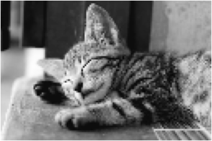
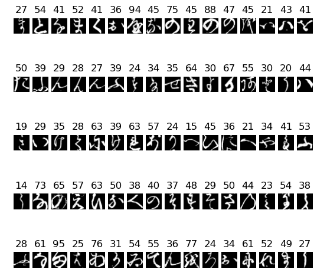
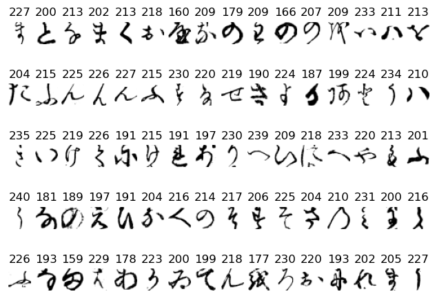
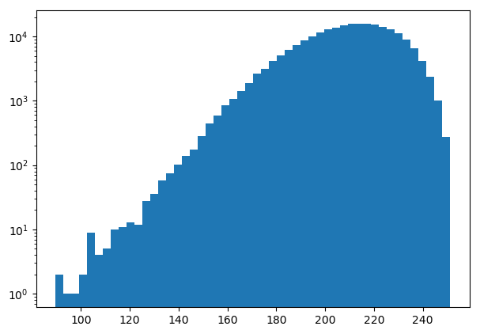
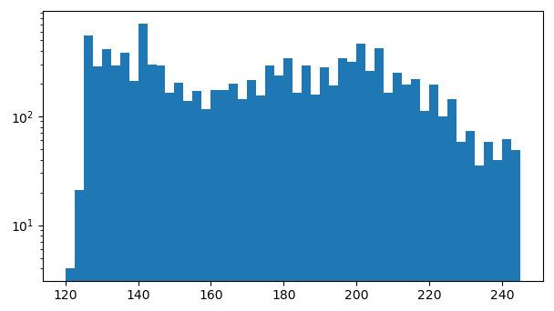

# Image Mosaic - GraayScale
## 준비사항
k49-train-imgs.npz 다운로드
```
https://github.com/rois-codh/kmnist
http://codh.rois.ac.jp/kmnist/dataset/k49/k49-train-imgs.npz
```

KMeans Clustering : 군집화 머신러닝중 한가지 방법
## Load and Resize Image
```
img_path = 'assets/images/samples/09.jpg'
img = cv2.imread(img_path, cv2.IMREAD_GRAYSCALE)  # 이미지를 gray 로 읽어옮
img = cv2.resize(img, dsize=None, fx=0.2, fy=0.2)  # 크기는 20%로 줄임
```
원본이미지

변환된 이미지 
```
plt.figure(figsize=(20, 20))
plt.axis('off')
plt.imshow(img, cmap='gray')
plt.show()
```


## Load and preview sample image
```
plt.figure(figsize=(20, 10))
for i in range(80):
    img_patch = 255 - sample_imgs[i]  # 255는 white (mnist는 까만배경에 하얀 글자 이므로 반대로 변경)

    plt.subplot(5, 16, i+1)
    plt.title(int(np.mean(img_patch)))  # 이미지 필셀의 평균값
    plt.axis('off')
    plt.imshow(img_patch, cmap='gray')
```
변경전 이미지

변경후 이미지


## Distribution of Patch Images
이미지들의 분포값을 표시
```
means = np.mean(255 - sample_imgs, axis=(1, 2))

plt.figure(figsize=(12, 6))
plt.hist(means, bins=50, log=True)  # histograph로 출력, 50개의 구역으로 나누고 log scale로 변경
plt.show()
```


## Adjust MinMax of Input Image
위의 이미지 분포도에서 빈도가 많은 부분에 대해 normalize 한다. \
여기서는 120에서 245사이값으로 처리. \
즉 원본의 고양이 이미지는 0 ~ 255 의 이미지 분포이지만 이것을 120 ~ 245의 mnist와 대응하게 처리할 예정 \
alpha는 최소값, beta는 최대값
```
img = cv2.normalize(img, dst=None, alpha=120, beta=245, norm_type=cv2.NORM_MINMAX)

plt.figure(figsize=(12, 6))
plt.hist(img.flatten(), bins=50, log=True)
plt.show()
```

## Organize Patch Images
작업이미지의 평균값을 bins라는 딕셔너리에 넣어둔다.
```
bins = defaultdict(list)

for img_patch, mean in zip(sample_imgs, means):
    bins[int(mean)].append(img_patch)
```
## Fill Images
```
h, w = img.shape
img_out = np.zeros((h * 28, w * 28), dtype=np.uint8)  # 28 * 28 pixcel로 빈이미지를 만들어준다.

for y in range(h):  # y(세로)
    for x in range(w): # y(가로)
        level = img[y, x]

        b = bins[level]

        while len(b) == 0:  # 패치이미지가 없을 경우
            level += 1
            b = bins[level]

        img_patch = 255 - b[np.random.randint(len(b))]

        img_out[y * 28:(y + 1) * 28, x * 28:(x + 1) * 28] = img_patch
```
## 이미지 출력

```
plt.figure(figsize=(20, 20))
plt.axis('off')
plt.imshow(img_out, cmap='gray')
```

## 이미지 저장
```
_ = cv2.imwrite('assets/results/%s_bw.jpg' % os.path.splitext(os.path.basename(img_path))[0], img_out)
```

